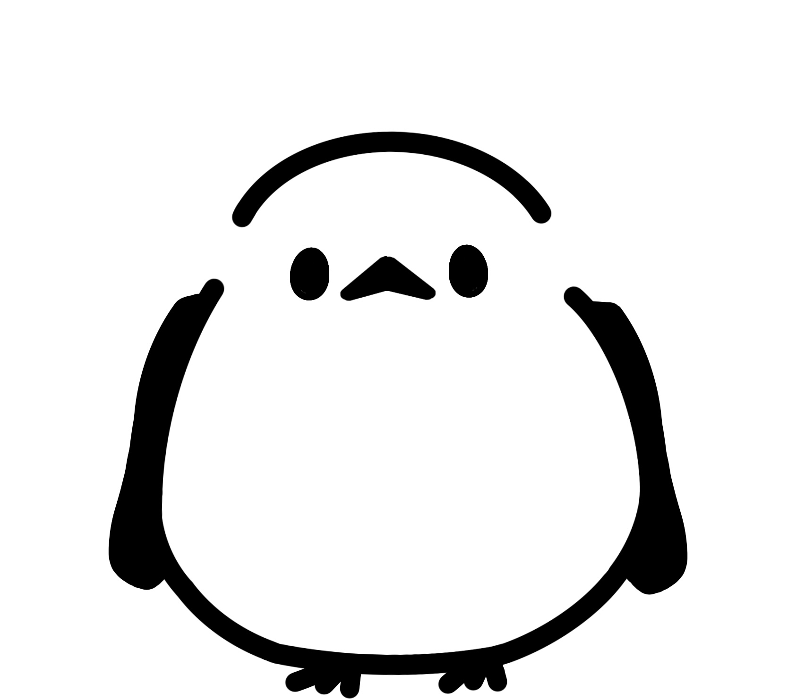

<p align="center">
  
</p>

# しまコネクト

<h2>
  
  概要
</h2>

『しまコネクト』は、学生4人のチームで**企画会議から設計・開発まで行ったWebアプリ**です。
「シマエナガ」＋「コネクト（つながり）」をテーマに、**誰でも気軽にハンドサインを作って投稿・閲覧できる掲示板アプリ**を開発しました。

『しまコネクト』では、自分で作ったハンドサインを画像付きで投稿できる掲示板機能を使用できます。
この掲示板で、他ユーザーが作成したハンドサインを閲覧することもできます。
お話ツールとして配布されている実行ファイルを使用すると、保存したハンドサインをカメラに向かって使用した際に、文字に変換されます。
これによってハンドサインをより楽しむことができます。

### 聴覚障害者にとってのメリット
- オープンな場でのコミュニティが広がる  
- 流行語などの柔軟な表現を取り入れた交流が可能になる

### 健常者にとってのメリット
- 手の動きによるコミュニケーションに関心を持つきっかけになる
- 気軽に使えるハンドサインに触れることで、手話を学ぶハードルを下げられる

---

<h2>
  
  企画背景
</h2>

- 手話は一般的にまだ普及していない
- 手話には文法・認定などの制約があり、流行語や新しい表現が取り入れづらい
- 既存の手話翻訳アプリには独創性が少ない

そこで、**もっと自由で、誰でも発信・共有できること**を目指してアプリ制作を進めました。

---

<h2>
  
  手話とハンドサインの違い
</h2>

| 項目 | 手話 | ハンドサイン（本アプリで扱う） |
|------|------|-----------------------------|
| 言語性 | 視覚言語 | 言語ではない |
| 統一性 | 国ごとに文法・単語がある | 自由に表現できる・不統一 |
| 認定 | 習得・認定に時間がかかる | 個人で創作・使用可能 |
| 利便性 | 制限が多い | 自由でカジュアル |

『しまコネクト』では、気軽に使用できるハンドサインを扱いました。
ハンドサインを普及させることで、手話の普及に貢献することも目指します。

---

<h2>
  
  『しまコネクト』の機能
</h2>

- 掲示板（投稿・閲覧・検索・並び替え） 
- ハンドサインの翻訳

『しまコネクト』の開発において、Webアプリ班と画像認識班の2チームに分かれて制作を進めました。

---

<h2>
  
  Webアプリ班
</h2>

私はWebアプリ班のフロントエンドエンジニアとして開発に携わり、以下の機能を実装しました：
- ユーザー登録・ログイン機能
- メイン画面・サブメニュー
- 掲示板（ハンドサインの投稿・新着順と人気順での表示・カテゴリー検索）

### 工夫した点
- 操作がわかりやすいようなシンプルな画面設計
- 使いやすさを向上させるためにサブメニューも実装
- 流行性を意識できるよう、人気順でのソート機能を実装
- セキュリティを強化するため、パスワードをハッシュ化してDB管理
- Cookie管理によるログインの有効期限制御

### 使用した技術
| 分類 | 技術 |
|------|------|
| フロントエンド | HTML, CSS, JavaScript, React, Figma |
| バックエンド | Node.js, MySQL |
| データベース | MySQL |

---

<h2>
  
  画像認識班
</h2>

- 手の形を認識・データ化する処理を、GoogleのMediaPipeで実装
- 認識結果の類似度をcos類似度で評価し、誤差を減少
- Python実行環境が不要になるよう、exeファイルとしてアプリ化

---

<h2>
  
  フォルダ構成
</h2>

```plaintext
web/
├── frontend/
│   ├── public/
│   └── src/
├── backend/
│   ├── Prisma/
│   ├── uploadIcon/
│   ├── uploadImage/
│   └── uploadVideo/

※ `.exe`ファイルなど大容量ファイルは GitHub の制限上アップロードしていませんが、『しまコネクト』内でダウンロードできるようになっています。
